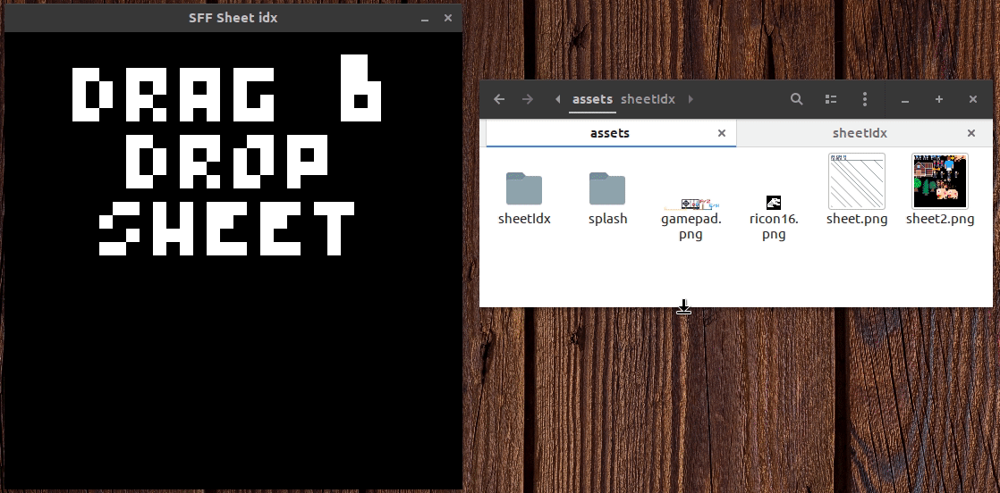

# sheetIdx
Get cell number of sprite inside sprite sheet.  

Use that number to reference the sprite in __sff-love__.  
Sprite sheet can have any name but __sff-love__ requires "sheet.png".  
Sprite sheet must be 128x128 pixels as per __sff-love__.  
Needs Löve 0.10.0 to run.  

